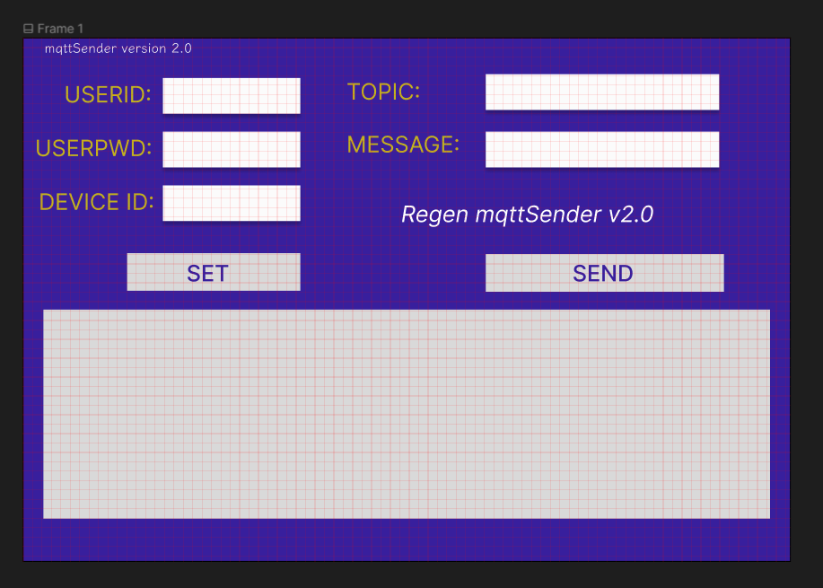

# MqttSender

## description

A Software For me to send message to my mqtt server
So that I can contral my devices such as esp32 ,esp8266.

Another purpose is to learn python tkinter(GUI lib)

### Technique

1. python tkinter
2. python pyinstaller
3. python mqtt

# requirements analization v1.0

## GUI

### version1.0

* conponents

1. 1 text call box（for output）
2. 1 entry box (for input)
3. a send button()

* features(or limits? qwq )

1. simple
2. change server(ip address, password , topics) by editing source code .

## mqtt

### paho-mqtt version 1.6

* description

When coding the parts of mqtt sucscribe and publish , I find that the mqtt lib had upugrade to version 2.0 . However , I get the version 1 example code . Making me annoyed.

So i just gona to use version 1.6

And I will definetly upgrade my code in the future.

* mqtt part function

get the content( payload ) and the server information(settings)  then send it.

## release

`pyinstaller gui_ver_1.py -p mqttSender.py`

# Version 2.0

## requirements analization v1.0

### GUI

)
